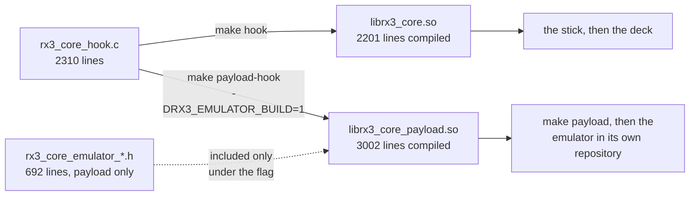

<!-- SPDX-License-Identifier: MPL-2.0 -->
# ⚙️ Performance core

You never tick this one. It has no controls, does nothing on its own, and the app adds it for you whenever you pick **Key shift** or **Stems**.

It is the part that draws things on the player's screen: the **KEY** and **STEMS** tabs, the buttons inside them, the blinking, and the touch handling that makes tapping them work. Both features need it; neither works without it.

## What that means for you

**There is no badge.** The mod does not announce itself anywhere. The way you know it loaded is that the **KEY** and **STEMS** tabs are there at all, if you see them, it is running.

**The two features are independent.** Key shift works without any stem files, and stems work without key shift. Pick either, both, or neither.

**A failure is contained.** If something is not as expected when stems try to attach, stems switch themselves off and key shift carries on. It is not all-or-nothing.

**It looks like the player's own screen** because it is. Everything drawn goes through the player's own renderer, reusing its fonts and its artwork, rather than being painted over the top. That is deliberate: a panel that looked bolted on would also *behave* bolted on.

Nothing is written to the player. Power off, pull the stick, and every trace of it is gone.

---

---

# For whoever builds this

`rx3_core_hook.c` compiles into two libraries from one source. Which one you get depends on whether `RX3_EMULATOR_BUILD` is defined.

The 801 lines a deck never compiles are there because a host running rbp under emulation has no front panel to press and no screen to look at. Each branch either injects an input the hardware would have produced, or reports something a person would have seen.

Three of them are large enough to live in their own file, included at the point they used to sit and only under the flag. The rest are call sites inside production functions, and stay where they are.

| Guarded code | Lines | What it adds to the payload build | Why a deck does not need it |
| --- | ---: | --- | --- |
| `rx3_core_emulator_harness.h` | 470 | The commands a host sends in place of a front panel: browse keys marked in rbp's own table, touch samples written into the TSC2007 path | The deck has a front panel and a touch panel |
| `rx3_core_emulator_breadcrumbs.h` | 155 | How far `init()` got, and the deck objects it built on the way | On a deck, the session log answers the same question afterwards |
| `rx3_core_emulator_keys.h` | 67 | Where rbp keeps the browse keys, and how it finishes one | Same |
| Text-layer trace, `RX3_EMULATOR_TRACE_LAYERS=1` | 36 | Lists which window layers issue a text draw, one line per distinct layer, with a hard ceiling | A diagnostic for one open question: whether the pad row draws text at all |
| Forced panel, `RX3_EMULATOR_PANEL` set to 1 or 2 | 20 | Opens the KEY or STEMS panel at start-up, so the real rendering branches are reachable and clickable | On a deck, someone presses the button |
| Render markers, touch thread, call sites | 53 | Says once that the first custom tab and the first custom pad painted; polls for injected touches | On a deck you look at the screen, and nothing is injected |

Two rules hold across all of it.

**The emulator branches observe and inject. They never change what the mod does.** The one exception is deliberate and visible at `hooked_set_beatfx_selected`: with a panel forced, the payload build short-circuits the native transition, because there is no front-panel microcontroller to request it.

**An injected input is guarded like any other entry point.** `UiKey_KeyPush`, `BrowseKeyProcessing` and `set_flg` each have their first eight bytes checked before the first call, for the reason `install_hook` checks a prologue: a firmware whose entry point has moved must be refused, not called.

`tests/test_hook_symbols.py` reads the `.dynsym` of **both** libraries, so a change that pulls a new import into either one fails the build.

---

How the on-screen additions are rendered, how the image table is extended, and the palette question that is still open: [Reference: the display](../../../../REFERENCES.md#4-the-display).
